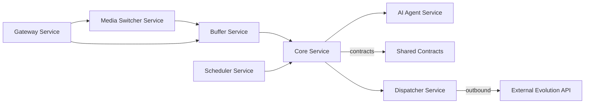

# Arquitectura de BegaBot 3.0

Resumen de alto nivel:

- La aplicación está compuesta por varios microservicios en Node.js y algunos paquetes compartidos.
- Orquestación principal con `docker-compose` desde la raíz del repositorio.

Servicios principales:

- `ai-agent-service`: agente que integra modelos de IA para tareas conversacionales.
- `buffer-service`: gestiona el buffer de mensajes y la agregación para Redis.
- `core-service`: lógica central del dominio y orquestación entre servicios.
- `gateway-service`: punto de entrada HTTP/webhook que normaliza y valida payloads.
- `packages/shared-contracts`: utilidades y contratos compartidos entre servicios.
- `media-switcher-service`: servicio independiente que procesa y normaliza medios (notas de voz, ubicaciones).
- `scheduler-service`: motor de tareas programadas para jobs periódicos y limpiezas.
- `dispatcher-service`: motor de envío y acciones salientes (pasarela a Evolution API / WhatsApp).

Flujo básico:

1. `gateway-service` recibe webhooks y normaliza payloads.
2. Mensajes normalizados se envían a `buffer-service` para agregación/persistencia temporal.
3. `core-service` aplica reglas de negocio y puede invocar `ai-agent-service` para análisis/decisión.
4. `ai-agent-service` procesa consultas de IA y devuelve respuestas/actions.

Diagrama simple (Mermaid):

Dónde buscar código relevante:

- [ai-agent-service](ai-agent-service)
- [buffer-service](buffer-service)
- [core-service](core-service)
- [gateway-service](gateway-service)
- [packages/shared-contracts](packages/shared-contracts)

Consejos para ejecutar localmente:

- Para levantar toda la pila: `docker-compose up -d` (desde la raíz).
- Para desarrollo de un servicio: entrar al directorio del servicio, `npm install` y `npm start` o `node server.js`.

Notas:

- Esta es una descripción inicial; los detalles por servicio están en `docs/modules/`.

Puertos asignados (entorno de desarrollo):

| Puerto | Servicio | Descripción |
|---:|---|---|
| 3001 | `gateway-service` | Ingestión, recepción de webhooks de Evolution API y sanitización inicial |
| 3002 | `buffer-service` | Control de estado y búfer temporal de mensajes en Redis |
| 3003 | `core-service` | Núcleo de Prisma ORM, PostgreSQL y Máquina de Estados |
| 3004 | `media-switcher-service` | Procesamiento y enrutamiento de notas de voz y multimedia |
| 3005 | `audit-metrics-service` | Registro asíncrono de latencia y consumo de tokens |
| 3006 | `scheduler-service` | Tareas programadas y limpiezas periódicas |
| 3007 | `dispatcher-service` | Motor de envío hacia Evolution API / WhatsApp |
| 3008 | `ai-agent-service` | Integración con Gemini / motor de IA |
| 5432 | `postgres` | Puerto nativo de PostgreSQL |
| 6379 | `redis` | Puerto nativo de Redis |

