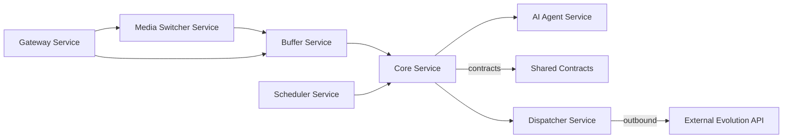

# Arquitectura de BegaBot 3.0

Resumen de alto nivel:

- La aplicación está compuesta por varios microservicios en Node.js y algunos paquetes compartidos.
- Orquestación principal con `docker-compose` desde la raíz del repositorio.

Servicios principales:

- `servicio-agente-ia`: agente que integra modelos de IA para tareas conversacionales.
- `servicio-buffer`: gestiona el buffer de mensajes y la agregación para Redis.
- `servicio-core`: lógica central del dominio y orquestación entre servicios.
- `packages/shared-contracts`: utilidades y contratos compartidos entre servicios.

Flujo básico:

1. Mensajes entrantes se envían a `servicio-buffer` para agregación/persistencia temporal.
2. `servicio-core` aplica reglas de negocio y puede invocar `servicio-agente-ia` para análisis/decisión.
4. `servicio-agente-ia` procesa consultas de IA y devuelve respuestas/actions.

Diagrama simple (Mermaid):

Dónde buscar código relevante:

- [servicio-agente-ia](servicio-agente-ia)
- [servicio-buffer](servicio-buffer)
- [servicio-core](servicio-core)
- [packages/shared-contracts](packages/shared-contracts)

Consejos para ejecutar localmente:

- Para levantar toda la pila: `docker-compose up -d` (desde la raíz).
- Para desarrollo de un servicio: entrar al directorio del servicio, `npm install` y `npm start` o `node server.js`.

Notas:

- Esta es una descripción inicial; los detalles por servicio están en `docs/modules/`.

Puertos asignados (entorno de desarrollo):

| Puerto | Servicio | Descripción |
|---:|---|---|
| 3001 | `servicio-buffer` | Control de estado y búfer temporal de mensajes en Redis |
| 3002 | `servicio-core` | Núcleo de Prisma ORM, PostgreSQL y Máquina de Estados |
| 3003 | `servicio-agente-ia` | Integración con Gemini / motor de IA |
| 5432 | `postgres` | Puerto nativo de PostgreSQL |
| 6379 | `redis` | Puerto nativo de Redis |

Integración con n8n:

- Configure en las variables de entorno de los servicios:
  - `N8N_WEBHOOK_URL` — URL del webhook de n8n que recibirá eventos (p. ej. https://tu-n8n/webhook/begabot-router)
  - `N8N_TOKEN` — token compartido que se envía en header `X-N8N-Token` para validar requests desde n8n

Uso recomendado:
- Los servicios pueden reenviar eventos a n8n vía `POST /n8n/forward` o llamar directamente a `N8N_WEBHOOK_URL`.

