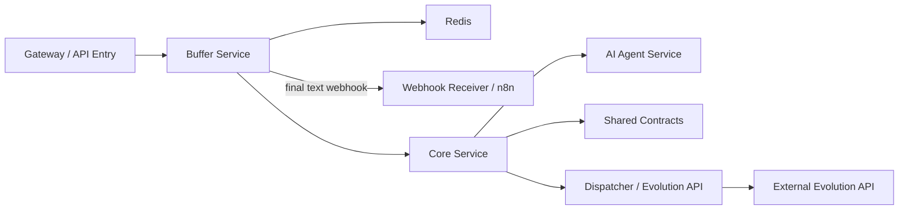

# Arquitectura de BegaBot 3.0

Resumen de alto nivel:

- La aplicación está compuesta por varios microservicios en Node.js y algunos paquetes compartidos.
- Orquestación principal con `docker-compose` desde la raíz del repositorio.
- Redis se usa como almacén de estado temporal para buffer de mensajes.
- PostgreSQL es la base de datos relacional principal para `servicio-core`.

Servicios principales:

- `servicio-buffer`: gestiona el buffer de mensajes, agregación de texto y expiración temporal con Redis.
- `servicio-core`: lógica central del dominio, persistencia en PostgreSQL mediante Prisma y orquestación entre servicios.
- `servicio-agente-ia`: agente que integra modelos de IA para tareas conversacionales y respuestas contextuales.
- `packages/shared-contracts`: utilidades y contratos compartidos entre servicios.

Flujo básico:

1. Los mensajes entrantes llegan a `servicio-buffer` para agregación y almacenamiento temporal.
2. `servicio-buffer` mantiene el texto acumulado en Redis y construye una lista de mensajes por `remoteJid`.
3. Tras el vencimiento del buffer, `servicio-buffer` extrae el texto final y puede publicar el resultado mediante webhook.
4. `servicio-core` consume la información de negocio y coordina acciones entre servicios.
5. `servicio-agente-ia` procesa solicitudes de IA y obtiene respuestas para el flujo conversacional.

Orquestación con n8n:

- La orquestación de webhook y coordinación entre `servicio-buffer`, `servicio-core` y `servicio-agente-ia` puede realizarse mediante un workflow de n8n incluido en este repositorio: `n8n/workflows/begabot-orchestrator.json`.
- Ese workflow actúa como receptor de webhooks desde el buffer y realiza llamadas HTTP a los servicios de backend, además de gestionar bloqueos, resets y envíos a la API de Evolution cuando corresponda.
- `servicio-autoreply-fb` es un adaptador externo independiente para Autoreply.io / Facebook y no forma parte del workflow n8n interno.

Rol de `servicio-buffer` en la arquitectura:

- API principal: `POST /api/buffer`
- Normaliza múltiples formatos de entrada y extrae `remoteJid` + `messageBody`.
- Genera y mantiene claves Redis:
  - `begabot:msg-buffer:<remoteJid>`: texto acumulado con TTL.
  - `begabot:msg-list:<remoteJid>`: lista de elementos de texto extraído.
  - `begabot:final:<remoteJid>`: resultado final del buffer tras expiración.
- Controla el tiempo de expiración con `MESSAGE_BUFFER_MS` (por defecto 5000 ms).
- Si está configurado, notifica el resultado final con un `POST` a `BUFFER_WEBHOOK_URL`.

Diagrama simple (Mermaid):

Detalles de ejecución:

- Levantar todo el stack: `docker-compose up -d` desde la raíz.
- Para desarrollo del buffer: `cd servicio-buffer && npm install && npm start`.
- El servicio expone salud en `GET /` y `GET /health`.

Variables de entorno relevantes para `servicio-buffer`:

- `PORT` — puerto HTTP del servicio.
- `REDIS_URL` — conexión a Redis.
- `BUFFER_WEBHOOK_URL` / `BUFFER_DESTINATION_URL` — URL de notificación final.
- `MESSAGE_BUFFER_MS` — duracion del buffer en ms.

Puertos asignados (entorno de desarrollo):

| Puerto | Servicio | Descripción |
|---:|---|---|
| 3001 | `servicio-buffer` | Buffer temporal de mensajes y agregación en Redis |
| 3002 | `servicio-core` | Lógica central y persistencia en PostgreSQL |
| 3003 | `servicio-agente-ia` | Motor de inteligencia artificial |
| 5432 | `postgres` | PostgreSQL nativo |
| 6379 | `redis` | Redis nativo |

Notas:

- `servicio-buffer` pretende desacoplar la llegada de eventos de WhatsApp del procesamiento posterior, reduciendo la carga en los servicios de negocio.
- La expiración del buffer se maneja con temporizadores en memoria junto con TTL en Redis.
- Si Redis no está disponible, el servicio puede degradar su comportamiento, pero el texto original se devuelve en modo "fail-open".

